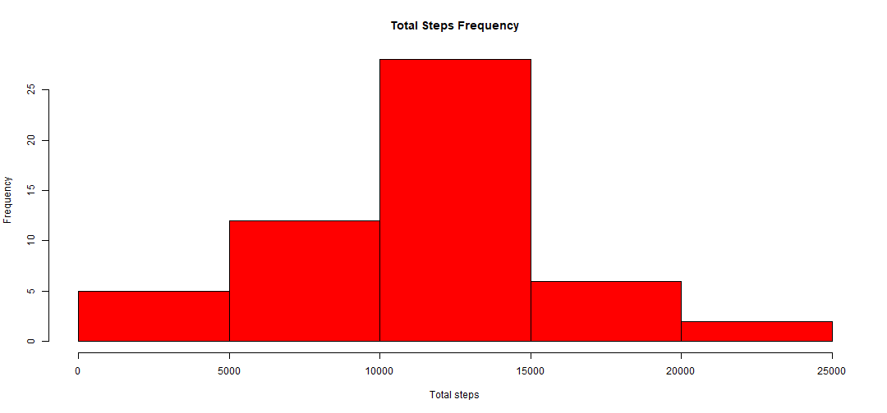
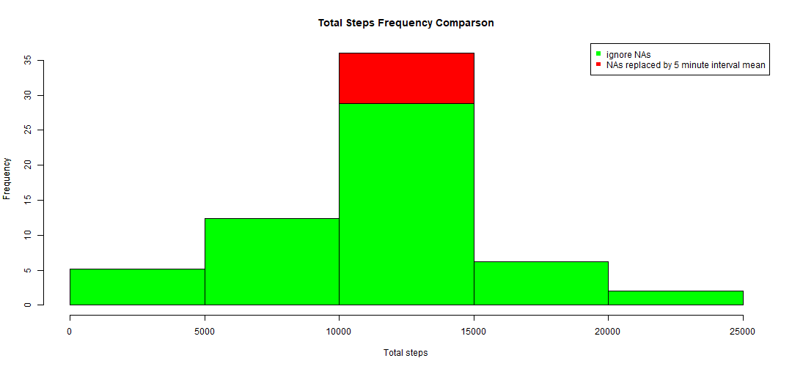

Activity Monitoring Analysis
============================

Here we are setting working directory, call relevant libraries, downloading and unzipping actvity data


```r
setwd(("C:/Users/Marin/Documents/Victor/ProgrAssignCourse5Week2"))
URL="https://d396qusza40orc.cloudfront.net/repdata%2Fdata%2Factivity.zip"
if (!(file.exists("repdata_data_activity.zip"))) {
        download.file(URL, destfile = 'repdata_data_activity.zip')
        unzip('repdata_data_activity.zip')
        }
act<-read.csv("activity.csv", header = TRUE, sep=",")
library(ggplot2)
library(dplyr)
```

QUESTION 1: What is the mean total number of steps taken per day?

Here we eliminate missing values and store the split of total steps by day in act_total

```r
act_total<- act %>%
        filter(!is.na(steps)) %>%
        group_by(date) %>%
        summarise(total_steps = sum(steps))
```

Building the histogram of total steps per day

```r
hist(act_total$total_steps,
        col=rgb(1,0,0), xlab = "Total steps", main = "Total Steps Frequency")
```




Storing the mean values of all the totals in act_mean:

```r
act_mean<- mean(act_total$total_steps)
act_mean
```

```
## [1] 10766.19
```
Storing median values of all the totals in act_med:

```r
act_med<-median(act_total$total_steps)
act_med
```

```
## [1] 10765
```
QUESTION 2: What is the average daily activity pattern?


Firstly, here we are building data set for the plot


```r
act_mean<- act %>%
        filter(!is.na(steps)) %>%
        group_by(interval) %>%
        summarise(mean_steps = mean(steps))
```

Secondly, building the plot:


```r
qplot(interval, mean_steps, data=act_mean)+geom_line()
```


What is exact interval corresponding to max mean value?

Storing it in 'imax' variable:

```r
imax<-act_mean$interval[which(act_mean$mean_steps==max(act_mean$mean_steps))]
imax
```

```
## [1] 835
```

QUESTION 3: imputing missing values

First, building the data frame and checking the number of rows in it, holding it in 'n'

```r
act_NA<-act%>%filter(is.na(steps))
n<-nrow(act_NA)
n
```

```
## [1] 2304
```

Second, building the new data frame act_new with imputed values.
Replacements donored by act_mean thus being mean steps for given interval


```r
act_new<-act
for (i in 1:nrow(act)){
        if (is.na(act_new[i,1]))
        act_new[i,1]<-act_mean[which(act_mean$interval==act_new[i,3]),2]
}
```

Then - building dataframe for total steps


```r
act_new_total<- act_new %>%
        filter(!is.na(steps)) %>%
        group_by(date) %>%
        summarise(total_steps = sum(steps))
```

And finally - plotting histogram in base.


```r
hist(act_new_total$total_steps,
     col=rgb(1,0,0), xlab = "Total steps",
     main = "Total Steps Frequency Comparson")
par(new=TRUE)#overlaying on the same hist for comparison
hist(act_total$total_steps,
     col=rgb(0,1,0), xlab = "", main = "",#overlaying old hist for comparison
     xaxt='n', yaxt='n', ylim = c(0,35))
legend("topright", pch=15, col=c("green", "red"),
       legend=c("ignore NAs", "NAs replaced by 5 minute interval mean"))
```




Although no change shape-wise vs initial one, clearly there is an increase in steps frequency due to imputed values for NAs.


Checking mean and median total number of steps taken per day and store in act_new_mean and act_new_med respectively


```r
act_new_mean<- mean(act_new_total$total_steps)
act_new_mean
```

```
## [1] 10766.19
```

```r
act_new_med<- median(act_new_total$total_steps)
act_new_med
```

```
## [1] 10766.19
```
-no material difference to previous numbers

QUESTION 4: are there differences in activity patterns between weekdays and weekends?

Again, for analysis puposes starting off with the new data frame

```r
act_wde<-act_new
```
Next - convert factor variable to date class, mutate, replace and factor

```r
act_wde$date<-as.Date(act_wde$date)
act_wde<-mutate(act_wde, wd=weekdays(date))
we <- c('Saturday', 'Sunday')
act_wde$wd <- factor((weekdays(act_wde$date) %in% we), 
        levels=c(TRUE, FALSE), labels=c('weekend', 'weekday')) 
```

Finally, grouping by intervals and weekdays/weekends, averaginging and plotting

```r
act_wde_mean<-act_wde%>%
        group_by(interval, wd)%>%
        summarise(mean_steps=mean(steps))

q<-qplot(interval, mean_steps, data=act_wde_mean,
      ylab='number of steps', facets=wd~.)+geom_line()
print(q)
```


You can see more even distribution of activities throuhgout weekends starting from interval 700, whereas weekdays demonstrate spikes for intervals 500-1000 with further activities flattening towards the end of the day with further slight increase in the evening time.
